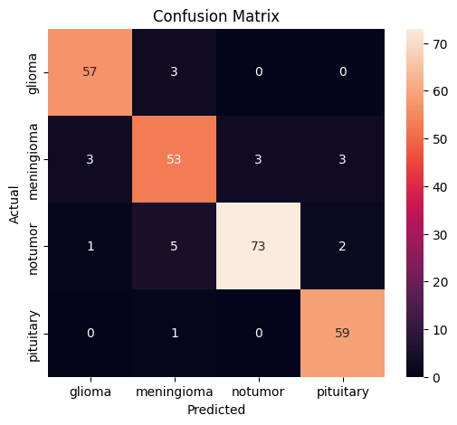
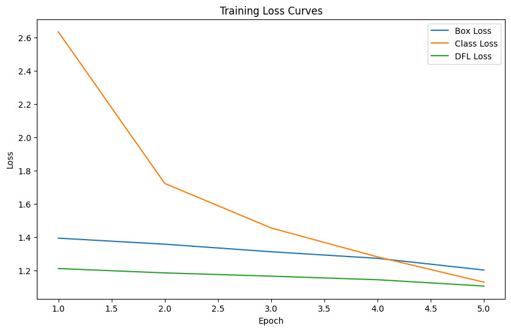

# Brain Tumor Detection & Classification

## 🧠 Project overview
This repository contains a complete two-stage MRI-based brain tumor detection system:

1. Image classification (`Brain_cls`) recognizes one of 4 classes: `glioma`, `meningioma`, `pituitary`, `notumor`.
2. Object detection (`Brain_det`) uses YOLO to localize tumor regions when classification indicates a tumor.

This README is written so readers can understand goals, datasets, method, results, and usage at a glance.

---

## 📦 Dataset sources
- Classification images: https://www.kaggle.com/datasets/shreyag1103/brain-mri-scans-for-brain-tumor-classification
- Detection images/annotations: https://www.kaggle.com/datasets/alirehman8008/brain-tumor-annotated-dataset

Class balance in `Brain_cls` (train/val/test approximate counts):
- glioma 240/60
- meningioma 245/61
- pituitary 240/60
- notumor ~240-260

Class label mapping in code: `glioma -> 0`, `meningioma -> 1`, `notumor -> 2`, `pituitary -> 3`.

---

## 🧩 Architecture and workflow
### 1. Classification (`Brain_cls/img_cls.ipynb`)
- Transfer learning model: VGG16 (ImageNet weights, `include_top=False`).
- Added densely connected head with dropout and softmax classification.
- Input size: 224x224x3, batch normalization, data tuning.
- Optimizer: Adam, epochs: 10.
- Training evaluation: accuracy/loss curves are auto-plotted in the notebook.

### 2. Object detection (`Brain_det/img_det.ipynb`, `Brain_det/img_det.py`)
- YOLO (Ultralytics) model training, final weights in `Brain_det/best.pt`.
- Pipeline in `img_det.py`: classify first with CNN; if tumor found (notumor excluded), run YOLO and show bounding boxes.
- Detection output includes class label, confidence, and annotated frame for display.

---

## 📈 Final results summary
### Classification (test split, 263 images)
- Overall accuracy: **92%**
- Macro avg: precision 0.92, recall 0.92, f1-score 0.92
- Weighted avg: precision 0.92, recall 0.92, f1-score 0.92
- Per-class details:
  - glioma: precision 0.93, recall 0.95, f1 0.94
  - meningioma: precision 0.85, recall 0.85, f1 0.85
  - pituitary: precision 0.92, recall 0.98, f1 0.95
  - notumor: strong support in test set.

## confustion matrics:



### Detection (from `Brain_det/results.csv`, 5 epochs)
- Final epoch:
  - precision: **0.8713**
  - recall: **0.8317**
  - mAP50: **0.8937**
  - mAP50-95: **0.6255**
- Trend: epoch1 mAP50=0.664, epoch5 mAP50=0.894. 5 epochs gave strong bounding-box detection.

## Learning Accuracy Curve



---

## 🧪 Test flow (`Brain_det/img_det.py`)
1. Load classifier (`Brain_cls/model.h5`) and detector (`Brain_det/best.pt`).
2. Load an MRI image (path in `test_file`).
3. Run classification:
   - if `notumor`, return message and skip detection;
   - otherwise run YOLO detection and display annotated image.
4. Output: class + confidence + detected boxes.

### Run locally
```bash
python Brain_det/img_det.py
```

### Example CLI output
- `Predicted Class : glioma`
- `Confidence      : 0.9852`
- Visualization shows bounding box around tumor.


---

## 📝 Quick reader takeaway
- No code reading is needed: the high-level logic is clearly separated in two folders.
- `Brain_cls` is for category detection (one of 4 classes). `Brain_det` is for localization with YOLO.
- Reproducible results are already captured in the notebooks and `results.csv`.

---

## 📸 Visualization guidance
- `Brain_cls` notebooks include training curves and confusion report plots.
- `Brain_det` notebooks include YOLO mAP curves and example detected frames.
- Add markdown image links to `docs/` if you want static web preview. Example:
  - ``.

---

## 🧭 Final phrase
This project can be used as a compact prototype for MRI tumor triage: classification for quick screening, followed by object detection for exact ROI output. The combined accuracy & detection quality is strong enough to support further medical-grade refinement.
